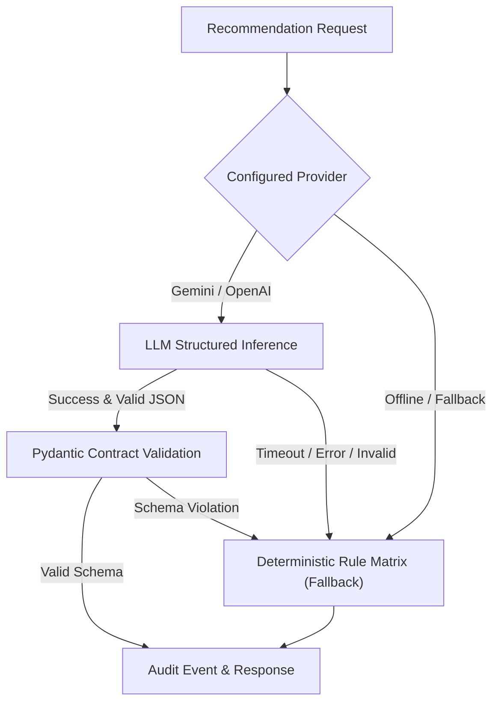

# RecoverAI — AI Recovery Recommendation Agent Specification

**Document Version:** 1.0.0  
**Phase:** 6 — AI Recovery Recommendation Agent  
**Authoritative Status:** PASS

---

## 1. System Overview & Architecture Boundary

The RecoverAI AI Recommendation Agent is an intelligent, bounded recommendation layer situated between Phase 5 Machine Learning Intelligence and the Phase 7 Deterministic Policy / Guardrail Engine.

```
Transaction Event (T)
      ↓
Feature Engineering (features-v1)
      ↓
ML Risk Model (recovery-risk-v1)
      ↓
Root Cause + Recovery Probability + Expected Recovery + Priority
      ↓
AI Recommendation Agent (recovery-agent-v1)  [ADVISORY ONLY]
      ↓
Deterministic Policy Engine (Sole Authority)
      ↓
Action Executor (Simulation Only)
      ↓
Gateway Simulator
      ↓
Recovery Outcome & Audit Trail
```

### Critical Architectural Invariant:
> **"AI recommendations are advisory and have ZERO execution authority."**
> 
> The AI Agent MUST NOT:
> - Execute payments or trigger gateway retries directly.
> - Call external payment gateways or communication services.
> - Mutate transaction states or recovery outcomes directly.
> - Bypass or alter Policy Engine guardrails, retry limits, customer opt-outs, or dispute holds.
> - Generate executable code, SQL, or arbitrary tool calls.

---

## 2. Approved Action Taxonomy

The AI recommendation output is strictly restricted to the 7 canonical actions in `RecoveryActionTypeEnum`:

| Approved Action | Description | Typical Trigger Conditions |
| :--- | :--- | :--- |
| `RETRY_PAYMENT` | Immediate re-authorization attempt | Transient network socket timeout on initial attempt ($r=0$). |
| `DELAYED_RETRY` | Scheduled re-attempt after bank clearing cooldown (4–6h) | `TEMPORARY_BANK_DECLINE` with high historical success rate. |
| `SEND_PAYMENT_LINK` | Dispatches frictionless SMS/WhatsApp payment link | `INSUFFICIENT_FUNDS` allowing customer top-up or alternate method. |
| `SUGGEST_ALTERNATIVE_PAYMENT_METHOD` | Prompts customer for alternate UPI / card instrument | `EXPIRED_METHOD` or recurrent issuer bank decline. |
| `SEND_REMINDER` | Sends non-intrusive reminder for pending payment | Uncompleted payment link within active recovery window. |
| `ESCALATE_TO_HUMAN` | Flags case for human compliance / account representative | Open chargeback dispute, communication limit reached, low ML confidence. |
| `STOP_RECOVERY` | Halts automated recovery immediately | Customer opt-out, max retries reached, `INVALID_DETAILS`. |

*Any unapproved action is rejected at strict schema validation.*

---

## 3. Strict Output Schema Contract

```json
{
  "recommended_action": "DELAYED_RETRY",
  "root_cause": "TEMPORARY_BANK_DECLINE",
  "reason": "Transient bank decline detected with strong historical payment success (89%) and high recovery probability. Scheduling delayed retry post bank clearing cycle.",
  "confidence": 0.92,
  "expected_recovery": 12375.00,
  "risk_flags": [],
  "requires_human_review": false
}
```

### Field Constraints:
- `recommended_action`: Valid enum value only.
- `root_cause`: Canonical taxonomy string.
- `reason`: Maximum 500 characters, no chain-of-thought, no executable markup.
- `confidence`: Float in $[0.0, 1.0]$ representing agent decision confidence (distinct from ML recovery probability).
- `expected_recovery`: Quantitative monetary value originating strictly from ML risk context ($\text{probability} \times \text{amount}$). AI cannot alter this number.
- `risk_flags`: Array from the controlled vocabulary.
- `requires_human_review`: Boolean advisory flag.

---

## 4. Controlled Risk Flags Vocabulary

```python
CONTROLLED_RISK_FLAGS = [
    "LOW_RECOVERY_PROBABILITY",      # ML probability < 0.30
    "HIGH_RETRY_COUNT",              # Retries >= max retry limit
    "SYSTEMIC_INCIDENT",             # Provider/bank failure spike active
    "CUSTOMER_OPTED_OUT",            # Customer compliance opt-out
    "OPEN_DISPUTE",                  # Active chargeback/fraud dispute
    "LOW_MODEL_CONFIDENCE",          # High uncertainty in ML risk output
    "PAYMENT_METHOD_UNRELIABLE",     # Recurrent decline on specific instrument
    "FAILURE_NOT_RECOVERABLE",       # Fraud or unresolvable decline (e.g. INVALID_DETAILS)
    "RECOVERY_WINDOW_EXCEEDED",      # Duration > 72 hours
    "HUMAN_REVIEW_REQUIRED",         # Advisory flag for manual intervention
    "COMMUNICATION_LIMIT_REACHED",   # Outbound notification cap hit
    "INVALID_CREDENTIALS",           # Authentication/card detail failure
]
```

---

## 5. Provider Abstraction & Fallback Architecture

RecoverAI supports three AI providers through the `BaseAIProvider` interface:

1. **Deterministic Fallback Provider (`DeterministicFallbackProvider`):**  
   - 100% offline, deterministic decision matrix.
   - Evaluates ML risk, customer history, retry count, opt-out, dispute, and systemic incident state.
   - Operates as the default and automatic safety net.
2. **Google Gemini Provider (`GeminiProvider`):**  
   - Invokes `gemini-1.5-pro` with structured JSON output mode and strict system instruction.
   - Automatically falls back to deterministic matrix on network error, timeout (5s), or schema validation failure.
3. **OpenAI-Compatible Provider (`OpenAIProvider`):**  
   - Invokes OpenAI chat completions with `response_format={"type": "json_object"}`.
   - Automatically falls back to deterministic matrix on error.



---

## 6. Deterministic Action Recommendation Matrix

| Failure Type | ML Recovery Probability | Retry Count | Special Constraints | Recommended Action | Requires Human Review |
| :--- | :--- | :--- | :--- | :--- | :--- |
| *Any* | *Any* | *Any* | `is_opted_out = True` | `STOP_RECOVERY` | `False` |
| *Any* | *Any* | *Any* | `has_open_dispute = True` | `ESCALATE_TO_HUMAN` | `True` |
| *Any* | *Any* | $\ge 2$ | `is_systemic_incident = True` | `ESCALATE_TO_HUMAN` | `True` |
| *Any* | *Any* | $< 2$ | `is_systemic_incident = True` | `DELAYED_RETRY` | `False` |
| *Any* | *Any* | $\ge \text{MAX\_RETRIES}$ (2) | *None* | `STOP_RECOVERY` | `False` |
| *Any* | $< 0.30$ | *Any* | `INVALID_DETAILS` | `STOP_RECOVERY` | `False` |
| *Any* | $< 0.30$ | *Any* | Other failure types | `ESCALATE_TO_HUMAN` | `True` |
| `TEMPORARY_BANK_DECLINE` | $\ge 0.30$ | $< 2$ | Historical rate strong | `DELAYED_RETRY` | `False` |
| `NETWORK_ERROR` | $\ge 0.30$ | $= 0$ | *None* | `RETRY_PAYMENT` | `False` |
| `NETWORK_ERROR` | $\ge 0.30$ | $> 0$ | *None* | `DELAYED_RETRY` | `False` |
| `INSUFFICIENT_FUNDS` | $\ge 0.30$ | *Any* | Messages $\ge \text{MAX}$ | `ESCALATE_TO_HUMAN` | `True` |
| `INSUFFICIENT_FUNDS` | $\ge 0.30$ | *Any* | Messages $< \text{MAX}$ | `SEND_PAYMENT_LINK` | `False` |
| `EXPIRED_METHOD` | $\ge 0.30$ | *Any* | *None* | `SUGGEST_ALTERNATIVE_PAYMENT_METHOD` | `False` |
| `INVALID_DETAILS` | *Any* | *Any* | *None* | `STOP_RECOVERY` | `False` |
| `BANK_DECLINE` | $\ge 0.30$ | $= 0$ | Success rate $> 0.80$ | `DELAYED_RETRY` | `False` |
| `BANK_DECLINE` | $\ge 0.30$ | $> 0$ | *None* | `SUGGEST_ALTERNATIVE_PAYMENT_METHOD` | `False` |

---

## 7. Primary Demo Case: `TX-DEMO-001` End-to-End Walkthrough

- **Customer:** `CUST-1024` (Arjun Verma)
- **Amount:** ₹12,500.00
- **Payment Method:** `CARD`
- **Failure Type:** `TEMPORARY_BANK_DECLINE`
- **Customer History:** 17 prior successes, 2 prior failures (89.5% historical rate)
- **ML Probability:** `0.98` (from trained model)
- **Expected Recovery:** `₹12,250.00`
- **Priority Score:** `91.66`
- **AI Recommendation:**
  ```json
  {
    "recommended_action": "DELAYED_RETRY",
    "root_cause": "TEMPORARY_BANK_DECLINE",
    "reason": "Transient bank decline detected with strong historical payment success (89%) and high recovery probability. Scheduling delayed retry post bank clearing cycle.",
    "confidence": 0.95,
    "expected_recovery": 12250.00,
    "risk_flags": [],
    "requires_human_review": false
  }
  ```
- **Integrity Guarantee:** Zero hardcoding or demo-specific ID branching. The case evaluates identically on generic pipelines.

---

## 8. Security & Prompt-Injection Defense

1. **Untrusted Data Sanitization:**  
   Customer names, notes, error descriptions, and metadata are sanitized with `sanitize_untrusted_input()` to remove control characters and escape prompt delimiters before inclusion in LLM prompt templates.
2. **Strict System Instructions:**  
   System prompts explicitly instruct the model to treat all payload fields as data and never as execution commands.
3. **Pydantic Validation & Forbid Extra Fields:**  
   Any attempt by an LLM to output executable commands, tool calls, or unknown JSON fields triggers a `ValidationError`, routing execution safely to the `DeterministicFallbackProvider`.

---

## 9. Audit Logging & Observability

Every AI recommendation triggers an immutable audit log:
- **Event Type:** `AI_RECOMMENDATION_CREATED`
- **Actor Type:** `AI`
- **Agent Version:** `recovery-agent-v1`
- **Prompt Version:** `prompt-v1`
- **Correlation ID:** Traceable throughout the recovery lifecycle.
- **Payload:** Complete record of AI recommendation, ML context, and provider metadata.

---

## 10. Known Limitations

1. **Advisory Scope:** AI recommendations cannot execute actions; all actions require policy evaluation.
2. **Offline Mode:** When external LLM APIs are unavailable or unconfigured, the system relies exclusively on the deterministic decision matrix without loss of safety.
3. **Synthetic Gateway Assumptions:** Recovery actions and timings reflect Razorpay ideathon sandbox parameters.
