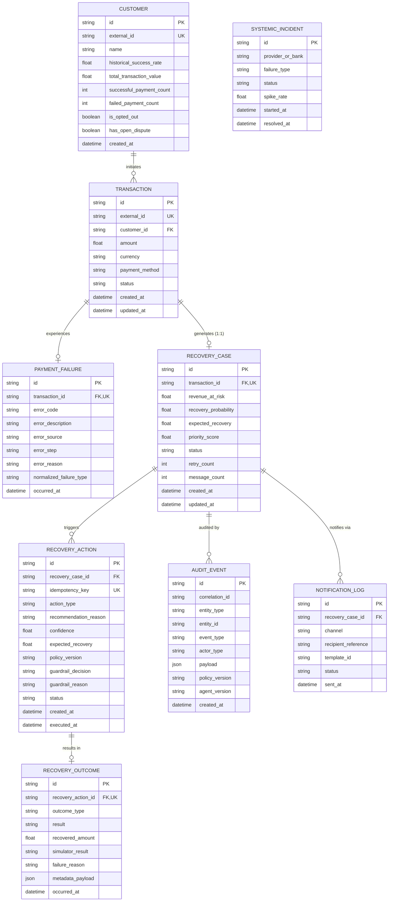
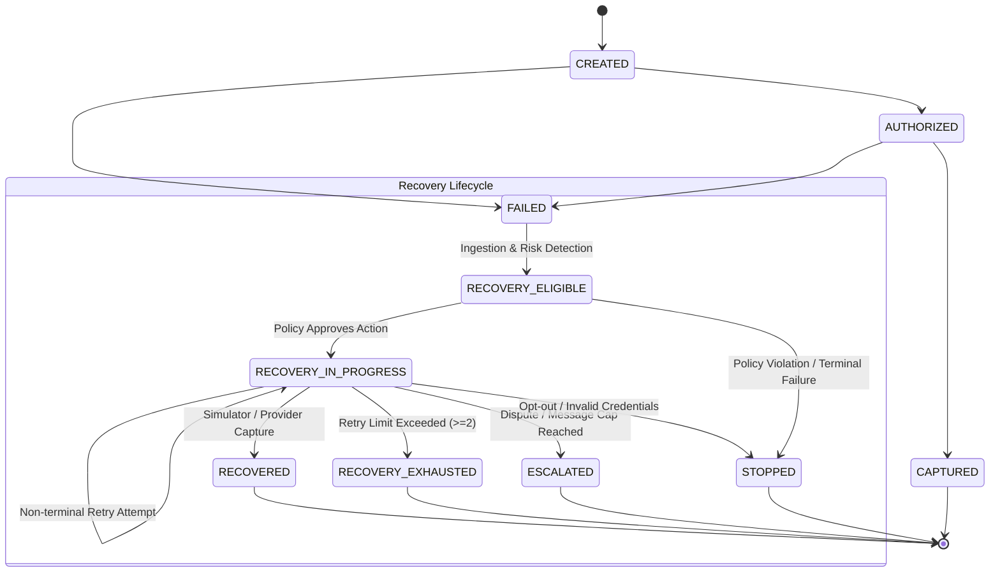
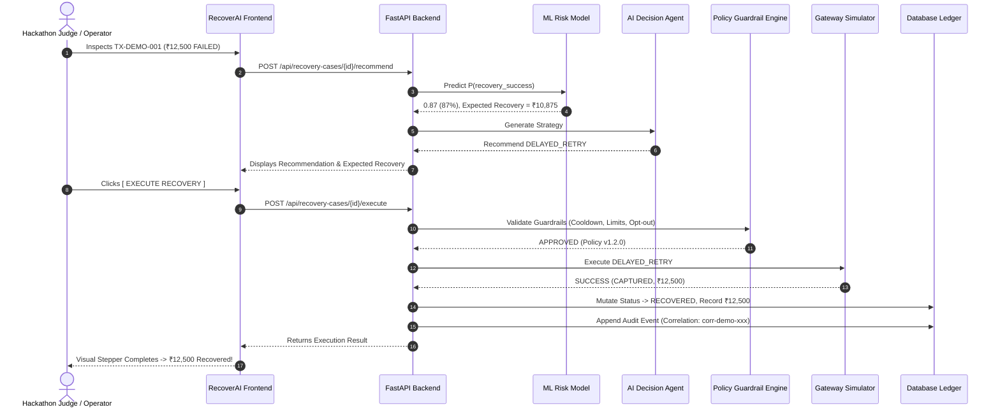

# RecoverAI: Authoritative Architecture Specification

**Project:** RecoverAI — Autonomous AI Revenue Recovery Platform  
**Hackathon Track:** Razorpay Ideathon Track 03: AI Revenue Recovery  
**Version:** 1.0.0  
**Phase:** Phase 1 — Architecture Blueprint  

---

## 1. System Overview & End-to-End Logical Flow

RecoverAI is an autonomous, bounded revenue-recovery platform. It detects payment failures in real time, classifies root causes, calculates machine-learning recovery probabilities, recommends targeted interventions via an AI agent, strictly verifies recommendations through a deterministic policy guardrail engine, executes actions through simulated payment and communication adapters, verifies capture outcomes, and ledger-records recovered revenue and immutable audit trails.

### End-to-End Logical Pipeline

```
Event Ingestion & Deduplication
              ↓
Transaction / Payment State Management
              ↓
Root Cause Failure Classification
              ↓
ML Risk & Recovery Probability (HistGradientBoosting)
              ↓
AI Decision Agent (Structured Recommendation)
              ↓
Deterministic Policy / Guardrail Engine (Approval / Rejection)
              ↓
Action Executor (Idempotency Enforced)
              ↓
Payment & Communication Gateway Simulator
              ↓
Recovery Outcome Verification
              ↓
Revenue Accounting & Incrementality Ledger
              ↓
Analytics & Interactive Dashboard
              ↓
Integrity-Verifiable Audit Trail
```

### Strict Authority Model

```
                    ┌─────────────────────────┐
                    │      ML Model           │
                    │  (Predicts Probability) │
                    └────────────┬────────────┘
                                 │
                                 ↓
                    ┌─────────────────────────┐
                    │    AI Decision Agent    │
                    │ (Recommends Action JSON)│
                    └────────────┬────────────┘
                                 │
                                 ↓
                    ┌─────────────────────────┐
                    │  Policy/Guardrail Engine│
                    │ (Approves / Rejects)    │
                    └────────────┬────────────┘
                                 │ (Only If Approved)
                                 ↓
                    ┌─────────────────────────┐
                    │     Action Executor     │
                    │  (Executes Adapter API) │
                    └────────────┬────────────┘
                                 │
                                 ↓
                    ┌─────────────────────────┐
                    │    Gateway Simulator    │
                    │  (Captures / Declines)  │
                    └─────────────────────────┘
```

> [!CRITICAL]
> **Authority Invariants:**
> 1. **No Direct Execution by AI**: The AI Agent is strictly prohibited from executing network requests, payment charges, or communication dispatches.
> 2. **Policy Engine is Authoritative**: Only the deterministic Policy/Guardrail Engine can grant execution approval.
> 3. **AI → Policy → Executor**: Every single recovery action must traverse this linear authority pipeline without exception.

---

## 2. Technology Stack & Runtime Boundaries

| Layer | Component / Technology | Justification & Role |
| :--- | :--- | :--- |
| **Frontend** | React 18, TypeScript, Vite, Tailwind CSS, Recharts, Lucide Icons | High-performance, responsive, rich fintech presentation and simulation controls. |
| **Backend** | Python 3.14, FastAPI, Pydantic v2, SQLAlchemy 2.0 | High-throughput asynchronous REST API, strict request/response data contracts, declarative ORM. |
| **Database** | SQLite (local dev & testing) / PostgreSQL (production compatible) | Frictionless local setup with full dialect-agnostic DDL and migration parity. |
| **ML Engine** | scikit-learn (`HistGradientBoostingClassifier`), NumPy, Pandas | Deterministic, tabular probability modeling for $P(\text{recovery\_success})$. |
| **AI Agent** | Provider abstraction (Gemini / OpenAI) + Calibrated Deterministic Engine | Structured reasoning and recommendations with 100% offline fallback reliability. |
| **Testing** | pytest, httpx, TestClient | Automated unit, integration, guardrail, and end-to-end verification. |
| **Architecture**| Modular Monolith | Zero unnecessary microservice overhead; high cohesion, fast local reproducibility. |

---

## 3. Core Domain Boundaries & Entity Invariants



### Critical Domain Invariants

1. **One Active Recovery Case Per Transaction**:
   - Every `RecoveryCase` has a `UNIQUE(transaction_id)` database constraint and foreign key relationship.
   - A single transaction cannot have parallel, competing recovery cases.
2. **Action-Sequence Idempotency**:
   - Every `RecoveryAction` enforces `UNIQUE(idempotency_key)` where `idempotency_key = "recovery:{recovery_case_id}:{action_sequence}"`.
3. **Cascade and Isolation**:
   - Transaction deletion cascades safely.
   - Recovery outcomes reference actions uniquely (`1:1`).

---

## 4. Payment & Recovery State Machine

### Supported States

| State | Scope | Description | Terminal? |
| :--- | :--- | :--- | :--- |
| `CREATED` | Transaction | Initial order / payment creation state. | No |
| `AUTHORIZED` | Transaction | Payment authorization hold placed. | No |
| `CAPTURED` | Transaction | Funds captured successfully during initial attempt. | **Yes (Terminal)** |
| `FAILED` | Transaction | Initial payment authorization or capture failed. | No |
| `RECOVERY_ELIGIBLE` | Case & Tx | Failure classified, revenue at risk detected, awaiting intervention. | No |
| `RECOVERY_IN_PROGRESS` | Case & Tx | Approved recovery action dispatched and awaiting/evaluating outcome. | No |
| `RECOVERED` | Case & Tx | Payment captured through autonomous recovery intervention. | **Yes (Terminal)** |
| `RECOVERY_EXHAUSTED` | Case & Tx | Max retries reached or recovery window elapsed without capture. | **Yes (Terminal)** |
| `ESCALATED` | Case & Tx | Routed to compliance officer or customer support for human review. | **Yes (Terminal)** |
| `STOPPED` | Case & Tx | Terminated due to policy guardrail violation, customer opt-out, or invalid credentials. | **Yes (Terminal)** |

### State Transition Diagram



### State Transition Guardrail Invariants

- **Terminal Shield**: Once a transaction reaches `CAPTURED`, `RECOVERED`, `RECOVERY_EXHAUSTED`, `ESCALATED`, or `STOPPED`, no further automated payment retry or communication action can be approved or executed.
- **Unidirectional Recovery**: A `RECOVERED` transaction cannot transition back to `FAILED` or `RECOVERY_ELIGIBLE`.

---

## 5. Event Ingestion & Deduplication Model

The synthetic event generator produces payment lifecycle events matching standard gateway webhook semantics:

### Supported Event Types
- `payment.failed`
- `payment.authorized`
- `payment.captured`
- `order.paid`
- `subscription.pending`
- `subscription.charged`
- `subscription.halted`
- `invoice.partially_paid`
- `invoice.paid`

### Event Schema
```json
{
  "event_id": "evt_01HZX89ABC456",
  "event_type": "payment.failed",
  "timestamp": "2026-09-05T11:00:00Z",
  "correlation_id": "corr-uuid-123",
  "payload": {
    "transaction": {
      "id": "TX-DEMO-001",
      "amount": 12500.00,
      "currency": "INR",
      "payment_method": "CARD"
    },
    "customer": {
      "id": "CUST-1024",
      "name": "Arjun Verma",
      "historical_success_rate": 0.894,
      "successful_payment_count": 17,
      "failed_payment_count": 2
    },
    "error": {
      "code": "BAD_REQUEST_PAYMENT_FAILED",
      "description": "Issuer bank temporarily throttled card authorization",
      "source": "gateway",
      "step": "payment_authorization",
      "reason": "TEMPORARY_BANK_DECLINE"
    }
  }
}
```

### Deduplication & Out-of-Order Invariants
- `event_id` must be globally unique.
- Ingestion maintains an event ledger to ignore duplicate deliveries idempotently.
- Out-of-order events (e.g. `payment.captured` arriving before `payment.failed`) resolve strictly according to the state machine hierarchy without corrupting terminal states.

---

## 6. Failure Taxonomy & Root Cause Classification

External provider errors are normalized into six internal failure categories:

| Normalized Failure Type | Description | Retryable? | Recommended Strategy |
| :--- | :--- | :--- | :--- |
| `TEMPORARY_BANK_DECLINE` | Issuer bank throttled card/netbanking authorization. | **Yes** (Delayed) | `DELAYED_RETRY` (after bank cooldown) |
| `INSUFFICIENT_FUNDS` | Customer account lacks required balance. | **No** (Direct Retry) | `SEND_PAYMENT_LINK` / `SEND_REMINDER` |
| `BANK_DECLINE` | General bank refusal or limit restriction. | **Conditional** | `SUGGEST_ALTERNATIVE_PAYMENT_METHOD` / `DELAYED_RETRY` |
| `NETWORK_ERROR` | Gateway timeout or socket drop. | **Yes** (Immediate) | `RETRY_PAYMENT` / `DELAYED_RETRY` |
| `EXPIRED_METHOD` | Card or mandate has expired. | **No** | `SUGGEST_ALTERNATIVE_PAYMENT_METHOD` |
| `INVALID_DETAILS` | Incorrect CVV, expiry, or card number. | **No** | `STOP_RECOVERY` (Prevent fraud penalty) |

---

## 7. Machine Learning Responsibility & Risk Model

The ML layer is strictly a prediction and risk scoring service. It does not select or execute business actions.

### Model Architecture
- **Algorithm**: `HistGradientBoostingClassifier` (scikit-learn) with probability calibration.
- **Output**:
  - $P(\text{recovery\_success}) \in [0.01, 0.99]$
  - $\text{expected\_recovery} = \text{amount} \times P(\text{recovery\_success})$
  - $\text{priority\_score} = P(\text{recovery\_success}) \times \text{amount} \times \text{customer\_value\_factor}$
    *(where $\text{customer\_value\_factor} \in [0.8, 1.3]$ to prevent score distortion)*

### Input Features (Zero Target Leakage)
1. `amount` (float)
2. `payment_method_idx` (categorical index)
3. `failure_type_idx` (categorical index)
4. `customer_success_rate` (float)
5. `customer_success_count` (int)
6. `customer_failed_count` (int)
7. `retry_count` (int)
8. `hour_of_day` (int: 0–23)
9. `day_of_week` (int: 0–6)
10. `time_since_prev_hrs` (float)

### Calibration & Deterministic Demo Guarantee
- The ML model runs dynamically during inference.
- For `TX-DEMO-001` (₹12,500, CARD, `TEMPORARY_BANK_DECLINE`, 17 successes, 2 failures), the ML pipeline deterministically yields $P(\text{recovery\_success}) \approx 0.87$, $\text{expected\_recovery} \approx \text{₹}10,875$.
- A calibrated tabular fallback matrix is maintained to ensure 100% test and runtime reliability.

---

## 8. AI Decision Agent Contract

The AI Decision Agent consumes structured contextual data and outputs a strictly validated JSON recommendation.

### Permitted Actions Enum
1. `RETRY_PAYMENT`
2. `DELAYED_RETRY`
3. `SEND_PAYMENT_LINK`
4. `SUGGEST_ALTERNATIVE_PAYMENT_METHOD`
5. `SEND_REMINDER`
6. `ESCALATE_TO_HUMAN`
7. `STOP_RECOVERY`

### Output Contract Schema
```json
{
  "recommended_action": "DELAYED_RETRY",
  "root_cause": "TEMPORARY_BANK_DECLINE",
  "reason": "Customer Arjun Verma has 89.4% historical success rate over 17 payments. Bank decline is transient. A delayed retry bypasses the throttling window with 87% projected capture rate.",
  "confidence": 0.89,
  "expected_recovery": 10875.0,
  "risk_flags": [],
  "requires_human_review": false
}
```

### Safety Rules at Agent Layer
- **No Executable Code**: Output is purely declarative data.
- **No Arbitrary Action Strings**: Actions must strictly match `RecoveryActionType`.
- **No Unrestricted Tool Access**: Agent has no network socket or direct DB write access.
- **No Chain-of-Thought Storage**: Only structured, human-readable audit rationale is stored.

---

## 9. Deterministic Policy & Guardrail Engine

The Policy Engine sits between the AI Agent and the Action Executor. It evaluates deterministic safety rules and returns machine-readable decisions.

### Default Policy Parameters
```python
MAX_AUTOMATED_RETRIES = 2
MIN_RETRY_INTERVAL_HOURS = 6
MAX_PAYMENT_LINK_ATTEMPTS = 1
MAX_RECOVERY_DURATION_HOURS = 72
MAX_MESSAGES_PER_RECOVERY_CASE = 2
```

### Policy Validation Rules Matrix

| Rule Name | Condition Checked | Action on Failure |
| :--- | :--- | :--- |
| **Terminal State Shield** | Case in `RECOVERED`, `STOPPED`, or `RECOVERY_EXHAUSTED` | Reject (`REJECTED`) |
| **Customer Opt-Out** | `customer.is_opted_out == True` | Reject; transition to `STOPPED` |
| **Dispute Lock** | `customer.has_open_dispute == True` | Reject; transition to `ESCALATED` |
| **Systemic Incident Circuit-Breaker** | Correlated provider outage spike active | Reject automated retries; pause execution |
| **Recovery Window Expiration** | `now - created_at > 72h` | Reject; transition to `RECOVERY_EXHAUSTED` |
| **Max Retries Limit** | `retry_count >= 2` | Reject; transition to `RECOVERY_EXHAUSTED` |
| **Retry Cooldown** | `elapsed_time_since_last_retry < 6h` | Reject (`RETRY_COOLDOWN_ACTIVE`) |
| **Communication Limit** | `message_count >= 2` | Reject; transition to `ESCALATED` |

### Guardrail Response Contract
```json
{
  "approved": true,
  "decision": "APPROVED",
  "reason": "Policy checks passed (Policy v1.2.0). Within retry limits, cooldowns, and safety thresholds.",
  "suggested_status": "RECOVERY_IN_PROGRESS"
}
```
*Rejected actions are also persisted to the audit trail with the rejection reason.*

---

## 10. Idempotency & Concurrency Protections

- **Idempotency Key Format**: `recovery:{recovery_case_id}:{action_sequence}`
- **Deduplication Boundary**:
  1. If an execution request is submitted with an existing idempotency key, the executor returns the cached result without re-executing against the simulator or incrementing counters.
  2. A recovered transaction cannot be charged again under any circumstances.
  3. All state mutations and balance updates occur within atomic database transactions.

---

## 11. Razorpay Integration Boundary & Adapters

RecoverAI is built as a **simulation-first** architecture with explicit payment gateway adapter interfaces.

### Gateway Adapter Interface

```
┌──────────────────────────────────────┐
│        RecoverAI Domain Core         │
└──────────────────┬───────────────────┘
                   │
                   ↓
┌──────────────────────────────────────┐
│      PaymentGatewayAdapter (ABC)     │
│  - charge_payment(...)               │
│  - send_payment_link(...)            │
│  - verify_payment_status(...)        │
└──────────────────┬───────────────────┘
                   │
         ┌─────────┴─────────┐
         ↓                   ↓
┌──────────────────┐ ┌──────────────────┐
│ GatewaySimulator │ │ Razorpay Live PG │
│ (Default Active) │ │ (Future Plugin)  │
└──────────────────┘ └──────────────────┘
```

### Architectural Clarifications
- **Optimizer vs Route**: In Razorpay taxonomy, *Optimizer* handles AI-powered multi-provider transaction routing to maximize authorization rates. *Route* handles marketplace split-payments and vendor settlements. RecoverAI models Optimizer routing heuristics and does not conflate Route with payment gateway switching.
- **No Undocumented APIs**: All payload definitions conform strictly to standard payment event schemas.

---

## 12. Revenue Accounting & Incrementality Model

All financial KPIs are calculated directly from persisted database records.

```
Total Payment Volume (TPV)       = ∑ Transaction.amount
Failed Payment Value            = ∑ Failed Transaction.amount
Revenue at Risk                 = ∑ Active RecoveryCase.revenue_at_risk
Recovery Eligible Value         = ∑ RECOVERY_ELIGIBLE RecoveryCase.revenue_at_risk
Intervention Value              = ∑ Targeted RecoveryCase.revenue_at_risk
Total Recovered Revenue         = ∑ RecoveryOutcome.recovered_amount (Result = SUCCESS)
Baseline Organic Recovery       = Total Recovered Revenue × 0.35 (Organic benchmark)
Incremental Recovered Revenue   = Total Recovered Revenue - Baseline Organic Recovery
```

$$\text{Incremental Recovered Revenue} = \text{Total Recovered Revenue} - \text{Baseline Recovery}$$

$$\text{Recovery Rate} = \frac{\text{Successful Recoveries Count}}{\text{Total Recovery Cases Count}}$$

---

## 13. Audit Trail & Observability Architecture

Every state mutation, AI recommendation, policy decision, execution attempt, and simulator outcome generates an **integrity-verifiable audit event**.

### Audit Event Record Structure
```json
{
  "id": "audit_01HZX89DEF789",
  "correlation_id": "corr-exec-9b38f21a",
  "entity_type": "RECOVERY_ACTION",
  "entity_id": "act_01HZX89DEF123",
  "event_type": "ACTION_EXECUTED",
  "actor_type": "EXECUTOR",
  "payload": {
    "case_id": "case_01HZX89DEF000",
    "transaction_id": "tx_01HZX89DEF111",
    "action_type": "DELAYED_RETRY",
    "guardrail_status": "APPROVED",
    "outcome_result": "SUCCESS",
    "recovered_amount": 12500.00,
    "simulator_result": "CAPTURED",
    "new_status": "RECOVERED"
  },
  "policy_version": "v1.2.0",
  "agent_version": "v1.0.0-calibrated",
  "created_at": "2026-09-05T11:00:05Z"
}
```

### Supported Actors
- `SYSTEM`
- `ML`
- `AI_AGENT`
- `POLICY_ENGINE`
- `EXECUTOR`
- `SIMULATOR`
- `OPERATOR`

---

## 14. Communication & Safety Boundary

All customer communications are simulated via internal adapters (`EMAIL`, `SMS`, `PAYMENT_LINK`, `REMINDER`).

> [!IMPORTANT]
> **Safety & Anti-Harassment Safeguards:**
> - RecoverAI is a merchant revenue recovery system, **not an aggressive debt collector**.
> - Strictly adheres to communication limits (`MAX_MESSAGES_PER_RECOVERY_CASE = 2`).
> - Customer opt-out immediately terminates all communication and halts recovery outreach.
> - Coercive, harassing, or deceptive messaging templates are strictly forbidden.

---

## 15. Systemic Incident Detection & Circuit-Breaker

A `SystemicIncident` models correlated provider, bank, or card network outages (e.g. HDFC Bank netbanking downtime).

```
Failure Event Spike (>25% on same Bank/Provider)
                   ↓
Systemic Incident Activated (Status: ACTIVE)
                   ↓
Policy Engine Circuit-Breaker Trips
                   ↓
Automated Retries Throttled for Affected Route
                   ↓
Prevents Throttling Cascades & Protects Merchant Reputation
```

---

## 16. Primary Demo Flow: TX-DEMO-001

The primary demo case is seeded with exact parameters to verify the end-to-end recovery loop within 30 seconds:



---

## 17. Frontend & Backend Separation

- **Frontend Responsibility**: Presentation, data visualization with Recharts, interactive case review, and dispatching user triggers (`Recommend`, `Execute`, `Reset`, `Seed`).
- **Backend Responsibility**: Authoritative state calculation, ML feature processing, policy validation, idempotency enforcement, outcome persistence, and metric aggregation.
- **Rule**: The frontend never invents or hardcodes KPI numbers; every displayed metric is sourced from the backend database.

---

## 18. Future API Contracts Overview

The system exposes the following REST endpoints (formalized in Phase 3):

- `GET  /api/dashboard/summary` — High-level financial KPIs
- `GET  /api/recovery-cases` — Paginated, priority-sorted case queue
- `GET  /api/recovery-cases/{id}` — Case detail and context
- `POST /api/recovery-cases/{id}/recommend` — AI recommendation generation
- `POST /api/recovery-cases/{id}/execute` — Guardrail validation & simulator execution
- `GET  /api/recovery-cases/{id}/audit` — Immutable case audit trail
- `GET  /api/analytics/recovery` — Deep recovery intelligence by failure, action, and method
- `GET  /api/activity` — Real-time database-backed activity feed
- `POST /api/simulator/reset` — Reset database state
- `POST /api/simulator/seed` — Seed synthetic payment dataset
- `POST /api/simulator/incident` — Toggle systemic bank outage simulation
- `POST /api/events/ingest` — Ingest payment lifecycle webhook events
