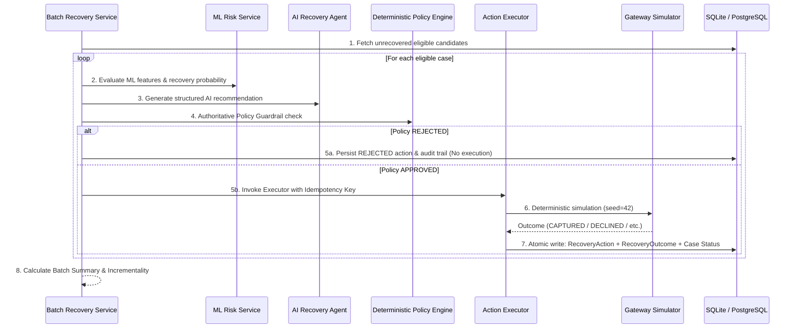

# Closed-Loop Batch Recovery Engine

## 1. Executive Summary & Core Objective

The **Batch Recovery Engine** is RecoverAI's enterprise-scale, autonomous execution layer for Track 03 of the Razorpay Ideathon (*"AI Revenue Recovery: Find revenue that's slipping away and win it back"*).

It orchestrates end-to-end recovery loops across hundreds of persisted failed payment cases simultaneously, strictly maintaining the authoritative boundaries:

$$\text{Failed Payments} \longrightarrow \text{ML Risk Intelligence} \longrightarrow \text{AI Recommendation} \longrightarrow \text{Deterministic Policy Guardrails} \longrightarrow \text{Action Executor} \longrightarrow \text{Gateway Simulator} \longrightarrow \text{Actual Outcome} \longrightarrow \text{Revenue Accounting}$$

### Absolute Authority Boundaries

| Layer | Responsibility | Authority / Constraint |
|---|---|---|
| **ML Model** | Predicts recovery probability $P(\text{Recovery})$ & root-cause likelihood | Advisory only; cannot execute actions or modify revenue |
| **AI Recommendation Agent** | Contextual strategy formulation & root-cause narrative | Advisory only; cannot bypass policy or call executor/simulator |
| **Deterministic Policy Engine** | 15-step invariant guardrail evaluation | **Authoritative approval/rejection authority**; 100% deterministic code |
| **Action Executor** | Idempotency enforcement, transaction atomic commits | Only executes `APPROVED` policy decisions |
| **Payment Gateway Simulator** | Outcome simulation with deterministic RNG seed | Simulation-first; zero live banking or customer API calls |
| **Closed-Loop Accounting** | Calculates actual & incremental recovered revenue | Reads strictly from persisted successful `RecoveryOutcome` records |

---

## 2. Batch Execution Pipeline

For every eligible recovery candidate ($status \in \{\text{FAILED}, \text{RECOVERY\_ELIGIBLE}, \text{RECOVERY\_IN\_PROGRESS}\}$):



---

## 3. Revenue Accounting Invariants

RecoverAI enforces strict non-negotiable financial accounting invariants:

1. **No Fake Revenue from Predictions**:
   $$\text{Recovered Revenue} = \sum \text{outcome.recovered\_amount} \quad \text{where } \text{outcome.result} = \text{SUCCESS}$$
   Predictions such as $\sum P(\text{Recovery}) \times \text{amount}$ or expected recovery are never booked as financial recovery.
2. **Deterministic Baseline vs. Agent Separation**:
   $$\text{Incremental Recovered Revenue} = \text{Agent Recovered Revenue} - \text{Baseline Recovered Revenue}$$
   $$\text{Incremental Lift} = \frac{\text{Incremental Recovered Revenue}}{\text{Baseline Recovered Revenue}}$$
3. **Double-Charge & Terminal Protection**:
   Transactions in terminal states (`CAPTURED`, `RECOVERED`, `RECOVERY_EXHAUSTED`, `STOPPED`, `ESCALATED`) are strictly protected from repeat payment retries.
4. **Idempotency Invariant**:
   All executions use compound idempotency keys:
   $$\text{key} = \text{recovery}:\{\text{case\_id}\}:\{\text{action\_sequence\_number}\}$$
   Calling `POST /api/recovery/batch-run` twice generates zero duplicate revenue and zero redundant charges.

---

## 4. API Endpoints

### Batch Execution
```http
POST /api/recovery/batch-run
Content-Type: application/json

{
  "limit": 500,
  "seed": 42,
  "dry_run": false
}
```

**Response (BatchRunSummary)**:
```json
{
  "batch_id": "BATCH-E5A3DF63DE",
  "started_at": "2026-09-05T15:48:44.001051Z",
  "completed_at": "2026-09-05T15:48:44.029915Z",
  "seed": 42,
  "dry_run": false,
  "total_candidates": 183,
  "ml_evaluated": 183,
  "ai_recommended": 183,
  "policy_approved": 157,
  "policy_rejected": 26,
  "actions_executed": 157,
  "successful_recoveries": 137,
  "failed_recoveries": 20,
  "escalated": 12,
  "stopped": 14,
  "skipped": 0,
  "baseline_recovered_revenue": 528266.18,
  "agent_recovered_revenue": 1509331.92,
  "incremental_recovered_revenue": 981065.74,
  "recovery_rate": 0.7486,
  "incremental_lift": 1.8571,
  "policy_block_rate": 0.1421,
  "execution_success_rate": 0.8726,
  "currency": "INR"
}
```

### Batch History
```http
GET /api/recovery/batch-history
```

---

## 5. Reproducible Verification Commands

```bash
# 1. Reset simulator database cleanly
curl -X POST http://localhost:8000/api/simulator/reset

# 2. Seed synthetic population (1,000 cases + TX-DEMO-001)
curl -X POST "http://localhost:8000/api/simulator/seed?n_cases=1000"

# 3. Run deterministic batch recovery
curl -X POST http://localhost:8000/api/recovery/batch-run \
     -H "Content-Type: application/json" \
     -d '{"limit": 500, "seed": 42, "dry_run": false}'

# 4. Confirm idempotency by running the exact same batch again
curl -X POST http://localhost:8000/api/recovery/batch-run \
     -H "Content-Type: application/json" \
     -d '{"limit": 500, "seed": 42, "dry_run": false}'
```
