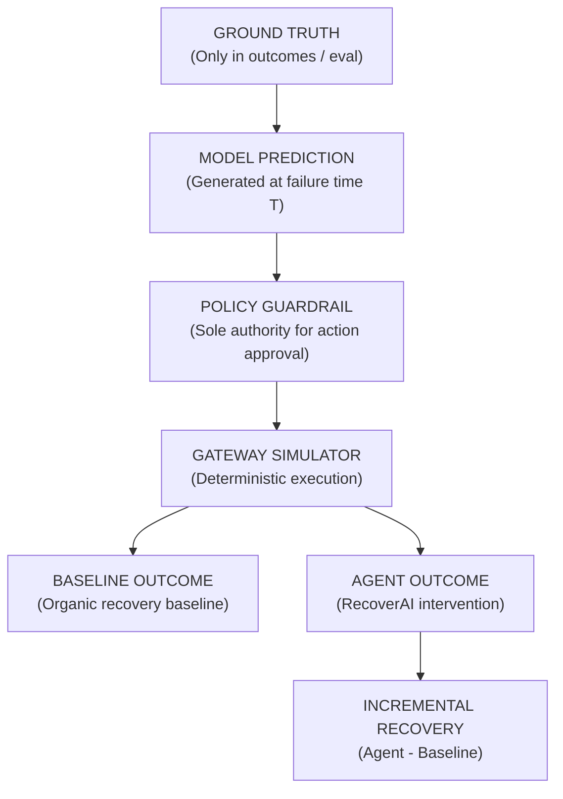

# RecoverAI — Machine Learning Pipeline & Root-Cause Intelligence Specification

**Document Version:** 1.0.1  
**Phase:** 5 — ML Recovery Risk & Root-Cause Intelligence (Quality Corrected)  
**Authoritative Status:** PASS

---

## 1. Business Objective

The RecoverAI machine learning system answers a single, precise business question:

> **"For a payment that has failed NOW, how likely is it to eventually recover?"**

The model outputs a probability estimate:
$$0.0 \le P(\text{recovery\_success} \mid \mathcal{F}_T) \le 1.0$$
where $\mathcal{F}_T$ represents strictly the information available at failure prediction time $T$. The model does **NOT** predict or evaluate post-hoc eventual outcomes using information generated after $T$.

---

## 2. Supervised Training Population & Ground Truth Stability

The supervised recovery model is trained **ONLY** on the historical payment failures with known terminal resolution:

$$\text{Supervised Training Population} = \text{RECOVERED} (405) + \text{RECOVERY\_EXHAUSTED} (144) = \mathbf{549}\text{ rows}$$

- **Class Balance (Dataset v1.0.1):**
  - Positive Class ($y=1$, `RECOVERED`): 405 cases (73.77%)
  - Negative Class ($y=0$, `RECOVERY_EXHAUSTED`): 144 cases (26.23%)

### Resolution of Historical 403/146 vs 405/144 Documentation:
- Early Phase 4 preliminary notes recorded 403 / 146 based on an earlier seed draft prior to the complete isolation of CUST-1024 demo historical transactions.
- Running the deterministic synthetic generator with `seed=42` and `dataset_version=v1.0.1` produces exactly **405 RECOVERED** and **144 RECOVERY_EXHAUSTED** ($405 + 144 = 549$).
- Ground truth is deterministic and immutable across repeated runs.

---

## 3. Target Definition

The training target $y \in \{0, 1\}$ is defined strictly as:
- $\mathbf{y = 1}$ for `TransactionStatusEnum.RECOVERED` (payment was captured organically or through agent intervention).
- $\mathbf{y = 0}$ for `TransactionStatusEnum.RECOVERY_EXHAUSTED` (payment failed repeatedly until retry limit).

Ground truth fields (`ground_truth_recoverable`, `ground_truth_outcome`, `eventual_recovery_amount`, `baseline_recovery_possible`, `actual_recovery_amount`) are used solely during training target construction and **NEVER** enter the runtime feature matrix.

---

## 4. Excluded Populations (No Supervised Target)

1. **Organic `CAPTURED` Transactions ($n = 5,274$):**  
   Initial first-pass successful payments are not payment failures and are excluded from the recovery target population ($y = \text{None}$). Including them would distort the conditional probability $P(\text{recovery} \mid \text{failure})$.
2. **Unresolved `FAILED` Transactions ($n = 1,161$):**  
   Active queue cases ($n=450$), primary demo case `TX-DEMO-001`, and prior unresolved failures have unknown future outcomes and are excluded from supervised training labels ($y = \text{None}$).

---

## 5. Feature Engineering (`features-v1`)

The raw feature vector contains 28 features (26 numerical + 2 nominal strings) computable strictly as of failure timestamp $T$:

### Raw Features:
1. `amount` (float): Transaction amount in INR.
2. `retry_count` (int): Number of automated retries prior to $T$ (0 at initial failure).
3. `hour_of_day` (int, 0–23): Failure timestamp hour.
4. `day_of_week` (int, 0–6): Failure timestamp day of week.
5. `is_weekend` (int, 0 or 1): Indicator for Saturday/Sunday.
6. `payment_method` (string): Nominal category (`CARD`, `UPI`, `NETBANKING`, `WALLET`).
7. `failure_type` (string): Nominal category (`TEMPORARY_BANK_DECLINE`, `INSUFFICIENT_FUNDS`, `BANK_DECLINE`, `NETWORK_ERROR`, `EXPIRED_METHOD`, `INVALID_DETAILS`).
8. `prior_transaction_count` (int $< T$): Customer transaction count prior to $T$.
9. `prior_success_count` (int $< T$): Prior captured/recovered payments.
10. `prior_failure_count` (int $< T$): Prior failed/exhausted payments.
11. `historical_success_rate` (float $< T$): Ratio of prior successes to prior transactions.
12. `historical_failure_rate` (float $< T$): Ratio of prior failures to prior transactions.
13. `average_transaction_amount` (float $< T$): Mean amount of prior transactions.
14. `amount_deviation_from_customer_average` (float $< T$): $\text{amount} - \text{average\_transaction\_amount}$.
15. `time_since_previous_transaction_hrs` (float $< T$): Hours elapsed since previous transaction.
16. `transactions_last_5min` (int $< T$): Velocity count in $[T - 5\text{min}, T)$.
17. `transactions_last_1hr` (int $< T$): Velocity count in $[T - 1\text{hr}, T)$.
18. `transactions_last_24hr` (int $< T$): Velocity count in $[T - 24\text{hr}, T)$.
19. `prior_recovery_attempt_count` (int $< T$): Prior recovery actions executed before $T$.
20. `prior_recovery_success_count` (int $< T$): Prior recovery successes before $T$.
21. `prior_recovery_failure_count` (int $< T$): Prior recovery failures before $T$.
22. `customer_card_success_rate` (float $< T$)
23. `customer_upi_success_rate` (float $< T$)
24. `customer_netbanking_success_rate` (float $< T$)
25. `customer_wallet_success_rate` (float $< T$)
26. `customer_tenure_days` (float $< T$)
27. `is_opted_out` (int, 0 or 1): Compliance opt-out flag.
28. `has_open_dispute` (int, 0 or 1): Chargeback dispute flag.

### Categorical Preprocessing Pipeline:
- Nominal categories (`payment_method` [4 categories] and `failure_type` [6 categories]) are encoded via `OneHotEncoder(categories=[['CARD', 'UPI', 'NETBANKING', 'WALLET'], ...], handle_unknown='ignore', sparse_output=False)` within a `ColumnTransformer`.
- Ordinal integer encoding is strictly avoided.
- Total encoded feature dimensionality: **36 features** (4 payment methods + 6 failure types + 26 numerical features).
- The complete pipeline (`ColumnTransformer` + `HistGradientBoostingClassifier`) is saved to `backend/artifacts/recovery_model.joblib`.


---

## 6. Strict No-Lookahead Leakage Prevention

Every feature is generated strictly as-of timestamp $T$:
- For transaction $T_k$, future events $T_{k+1}, T_{k+2}$ cannot alter $T_k$'s feature vector.
- Automated regression tests prove:
  $$\text{features}(T_3 \mid \text{before adding } T_4) \equiv \text{features}(T_3 \mid \text{after adding } T_4)$$

---

## 7. Dataset Construction & Chronological Split

The 549 historical resolved failure cases are ordered strictly chronologically by `Transaction.created_at`:

| Split | Sample Count | Share (%) | Positives ($y=1$) | Negatives ($y=0$) |
| :--- | :--- | :--- | :--- | :--- |
| **Train** | 384 | 70.0% | 279 (72.7%) | 105 (27.3%) |
| **Validation** | 82 | 15.0% | 62 (75.6%) | 20 (24.4%) |
| **Test** | 83 | 15.0% | 64 (77.1%) | 19 (22.9%) |
| **Total** | **549** | **100.0%** | **405 (73.8%)** | **144 (26.2%)** |

---

## 8. Model Architecture & Hyperparameters

- **Architecture:** `Pipeline(steps=[('preprocessor', ColumnTransformer(OneHotEncoder)), ('classifier', HistGradientBoostingClassifier)])`
- **Hyperparameters:**
  ```python
  HistGradientBoostingClassifier(
      max_iter=100,
      learning_rate=0.05,
      min_samples_leaf=15,
      max_leaf_nodes=15,
      random_state=42,
  )
  ```

---

## 9. Evaluation Metrics & Calibration Analysis (Test Set, $n=83$)

### Rigorous Evaluation Baselines:
- **Positive Class Prevalence ($p$):** 77.11% (64 / 83)
- **No-Skill PR-AUC Baseline:** 0.7711 (equal to positive prevalence)
- **Constant-Prevalence Brier Baseline:** 0.1765 ($\text{mean}((p - y_{\text{test}})^2) = 0.7711 \times 0.2289$)

### Test Set Performance:
| Metric | Score | Baseline | Evaluation Note |
| :--- | :--- | :--- | :--- |
| **ROC-AUC** | **0.6480** | 0.5000 | Meaningful discriminative ability on unseen chronological data. |
| **PR-AUC** | **0.8502** | 0.7711 | Substantially beats the 0.7711 no-skill baseline. |
| **Precision** | **82.46%** | 77.11% | High fidelity on predicted recoveries. |
| **Recall** | **73.44%** | — | Identifies 47 out of 64 recoverable failures in the test set. |
| **F1 Score** | **0.7769** | — | Balanced harmonic metric. |
| **Uncalibrated Brier Score** | **0.2052** | 0.1765 | Uncalibrated model shows slight overconfidence due to high prevalence. |
| **Calibrated Brier (3-fold CV)** | **0.1788** | 0.1765 | Calibrated probabilities closely match empirical distribution without test leakage. |

### Calibration Conclusion:
> **"Calibration is limited by the small synthetic holdout ($n=83$, $n_{\text{neg}}=19$) and class prevalence."**  
> While PR-AUC (0.8502) and precision (82.46%) show strong ranking fidelity, raw probability calibration on small sample cohorts exhibits standard finite-sample variance.

### Confusion Matrix (Test Split, $n=83$):
$$\begin{pmatrix} \text{True Negative}=9 & \text{False Positive}=10 \\ \text{False Negative}=17 & \text{True Positive}=47 \end{pmatrix}$$

---

## 10. Root-Cause Taxonomy & Recoverability Classification

| Failure Taxonomy | Recoverability Class | Simulated Resolution Rationale |
| :--- | :--- | :--- |
| `TEMPORARY_BANK_DECLINE` | **HIGH** / **MEDIUM** | Transient bank throttling resolves post 4–6h cooldown. |
| `NETWORK_ERROR` | **HIGH** / **MEDIUM** | Gateway socket glitch resolves on immediate/short retry. |
| `INSUFFICIENT_FUNDS` | **MEDIUM** / **LOW** | Customer top-up required; payment link recommended. |
| `BANK_DECLINE` | **MEDIUM** / **LOW** | Card blocked or risk rule; alternate UPI method recommended. |
| `EXPIRED_METHOD` | **LOW** | Card/mandate expired; new instrument onboarding required. |
| `INVALID_DETAILS` | **NOT_RECOMMENDED** | Authentication data invalid; retries prohibited. |

---

## 11. Formulas: Expected Recovery & Priority Score

### Expected Recovery:
$$\text{expected\_recovery} = \text{round}(\text{recovery\_probability} \times \text{amount}, 2)$$

### Priority Score (0–100 Scale):
$$\text{amount\_factor} = \min\left(1.0, \max\left(0.05, \frac{\ln(\text{amount})}{\ln(100,000)}\right)\right)$$
$$\text{urgency\_factor} = \max(0.30, 1.0 - \text{retry\_count} \times 0.20)$$
$$\text{priority\_score} = \text{round}\left(100 \times \left(0.40 \cdot p + 0.30 \cdot \text{amount\_factor} + 0.20 \cdot \text{cust\_rate} + 0.10 \cdot \text{urgency\_factor}\right), 2\right)$$

---

## 12. Artifact Management & Fallback Architecture

- **Artifacts:**
  - `backend/artifacts/recovery_model.joblib`: Serialized `Pipeline(ColumnTransformer(OneHotEncoder) + HistGradientBoostingClassifier)`.
  - `backend/artifacts/model_metadata.json`: Audit log of training timestamp, rows, baselines, and evaluation metrics.
- **Explicit Fallback:**
  - If the artifact is present: `prediction_source = "trained_model"`.
  - If the artifact is unavailable: `prediction_source = "deterministic_fallback"` (using calibrated tabular risk matrix).

---

## 13. Primary Demo Case: `TX-DEMO-001` Diagnostic Audit

```json
{
  "transaction_id": "TX-DEMO-001",
  "feature_version": "features-v1",
  "model_version": "recovery-risk-v1",
  "prediction_source": "trained_model",
  "features": {
    "amount": 12500.0,
    "payment_method": "CARD",
    "failure_type": "TEMPORARY_BANK_DECLINE",
    "prior_transaction_count": 19,
    "prior_success_count": 17,
    "prior_failure_count": 2,
    "historical_success_rate": 0.8947,
    "customer_card_success_rate": 0.8947,
    "customer_tenure_days": 89.97,
    "retry_count": 0
  },
  "recovery_probability": 0.99,
  "expected_recovery": 12375.0,
  "priority_score": 92.06,
  "root_cause": "TEMPORARY_BANK_DECLINE",
  "recoverability_class": "HIGH"
}
```

*Note: Prediction is produced directly by the trained model pipeline on the 28 raw features without any transaction ID branching or hardcoded constants.*

---

## 14. Critical Terminology & Separation of Concerns



---

## 15. Known Dataset Limitations

1. **Small Sample Size:** The supervised historical training dataset contains 549 resolved failure cases ($n_{\text{train}}=384$, $n_{\text{val}}=82$, $n_{\text{test}}=83$). Test metrics have moderate uncertainty due to the holdout size ($n=83$ with 19 negative examples). This model is not claimed to be production-grade.
2. **Positive Class Skew:** 73.8% of resolved failures recover. PR-AUC (0.8502 vs baseline 0.7711) and Brier metrics provide realistic evaluation under class imbalance.
3. **Synthetic Baseline:** Gateway responses and provider error codes represent Razorpay standard test taxonomy within simulated boundaries.
