# RecoverAI — Payment Simulator, Event Ingestion & Synthetic Dataset Specification

**Document Version:** 1.0.0  
**Phase:** 4 — Payment Simulator + Event Ingestion + Synthetic Dataset (Correction Patch Applied)  
**Authoritative Status:** PASS

---

## 1. Simulation Boundary & Architecture

RecoverAI is built simulation-first to provide safe, realistic, and 100% reproducible testing of autonomous revenue recovery workflows without connecting to production payment credentials or making live bank calls.

```mermaid
graph TD
    subgraph Core Architecture
        RecoveryService["Recovery Service"] --> PolicyEngine["Policy Guardrail Engine"]
        PolicyEngine --> PaymentAdapter["Payment Gateway Adapter"]
        PaymentAdapter --> Simulator["Payment Gateway Simulator"]
        Simulator --> OutcomeLedger["Outcome & Ledger Persistence"]
        OutcomeLedger --> AuditTrail["Integrity-Verifiable Audit Trail"]
    end
    
    subgraph Ingestion Pipeline
        Webhooks["Webhook Ingestion (POST /api/events/ingest)"] --> Deduplication["Deduplication & Order Verification"]
        Deduplication --> RecoveryCases["Recovery Case Generator"]
    end
```

### Critical Negative Constraints:
- **No Real Bank Calls:** Simulator operates completely in-memory with synthetic mock references (`sim_pay_...`).
- **No Real Customer Communications:** SMS, Email, and Payment Links are simulated via `NotificationLog`.
- **No Double-Charging:** Already recovered/captured transactions reject subsequent execution charges.

---

## 2. Deterministic Seed & Persisted Synthetic Dataset Metrics

To ensure reproducible machine learning benchmarks and predictable demo execution, the synthetic data generator uses an explicit seeded Pseudo-Random Number Generator (`seed = 42`).

### Persisted Dataset Figures (Actual Database Verification):
- **Dataset Version:** `v1.0.0`
- **Seed:** `42`
- **Total Customer Profiles:** `351` (350 synthetic cohort + 1 primary demo `CUST-1024`)
- **Total Persisted Transactions (`TOTAL_TRANSACTIONS`):** `6,984`
- **Total Payment Failures:** `1,710`
- **Actual Failure Rate:** `24.48%` ($\text{failure\_rate} = \frac{1,710}{6,984} = 0.2448$)
- **Total Recovery Cases:** `1,000` (549 historical resolved + 450 active queue + 1 primary demo case)

### Mutually Exclusive Transaction Partitioning:
All 6,984 persisted transactions in `Transaction.status` map to exactly one mutually exclusive status category:

| Category | Persisted Count | Share (%) | Description |
| :--- | :--- | :--- | :--- |
| **`CAPTURED`** | 5,274 | 75.51% | Initial organic successful transactions without prior payment failure. |
| **`FAILED`** | 1,161 | 16.62% | Currently failed transactions (450 active queue cases, 1 primary demo `TX-DEMO-001`, 710 historical prior failures). |
| **`RECOVERED`** | 403 | 5.77% | Historical failed transactions successfully recovered via baseline or agent intervention. |
| **`OTHER` (`RECOVERY_EXHAUSTED`)** | 146 | 2.09% | Historical failed transactions where recovery attempts were exhausted without capture. |
| **`TOTAL_TRANSACTIONS`** | **6,984** | **100.00%** | $\text{TOTAL} = \text{CAPTURED} (5,274) + \text{FAILED} (1,161) + \text{RECOVERED} (403) + \text{OTHER} (146)$ |

### Relationship to Payment Failures:
$$\text{Total Failures} (1,710) = \text{FAILED} (1,161) + \text{RECOVERED} (403) + \text{RECOVERY\_EXHAUSTED} (146)$$
$$\text{Total Successful Payments} (5,677) = \text{CAPTURED} (5,274) + \text{RECOVERED} (403)$$

- **Chronological Ordering:** Transactions for each customer are strictly ordered in time ($t_1 < t_2 < \dots < t_k$) with strictly positive intervals ($t_j - t_{j-1} > 0$).
- **No Negative Time Deltas:** Temporal progression guarantees no negative intervals.
- **No Lookahead Feature Leakage:** Predictive features at transaction time $T$ are computed exclusively from events at or before $T$.
- **ML Supervised Training Population & Target Definition:**
  - **Supervised Training Population:** The recovery prediction model's supervised training population consists **ONLY** of resolved historical payment failures:
    $$\text{ML Training Population} = \text{RECOVERED} (403) + \text{RECOVERY\_EXHAUSTED} (146) = \mathbf{549}\text{ cases}$$
  - **Binary Recovery Targets ($y$):**
    - $\mathbf{y = 1}$ for `RECOVERED` ($n = 403$, payment was successfully captured post-failure).
    - $\mathbf{y = 0}$ for `RECOVERY_EXHAUSTED` ($n = 146$, recovery attempts concluded unsuccessfully).
  - **Excluded Populations (No Supervised Target):**
    - **`CAPTURED` ($n = 5,274$):** Organic first-pass successful payments are not payment failures/recovery candidates and are **excluded** from the recovery model training population.
    - **Unresolved `FAILED` ($n = 1,161$):** Active queue cases ($n = 450$), primary demo case `TX-DEMO-001`, and prior unresolved failures are **excluded** from supervised training because their eventual recovery outcome is not yet known.

---

## 3. Customer Distribution & Temporal Modeling

Customers represent diverse commercial and retail transaction profiles:

| Customer Archetype | Success Rate Range | Typical Methods | Amount Range | Behavior |
| :--- | :--- | :--- | :--- | :--- |
| **High-Reliability Enterprise** | 85% – 95% | CARD, NETBANKING | ₹15,000 – ₹85,000 | Low failure rate; transient bank throttling or network glitches. |
| **Regular Consumer** | 70% – 85% | UPI, CARD, WALLET | ₹2,500 – ₹15,000 | Occasional temporary decline or insufficient funds. |
| **Unstable / High-Risk** | 40% – 60% | UPI, CARD | ₹500 – ₹5,000 | Frequent insufficient balance or expired mandates. |
| **Opted-Out / Disputed** | Variable | CARD, EMANDATE | Variable | Has compliance opt-out or active chargeback flag. |

---

## 4. Failure Taxonomy & Outcome Compatibility Matrix

RecoverAI maps provider error codes into six standard failure categories with deterministic simulated outcome profiles:

| Failure Type | Simulated Frequency | Primary Recommended Action | Base Recovery Chance | Simulated Behavior |
| :--- | :--- | :--- | :--- | :--- |
| `TEMPORARY_BANK_DECLINE` | 35% | `DELAYED_RETRY` | 88% | Transient bank throttling resolves after a 4–6 hour cooldown. |
| `INSUFFICIENT_FUNDS` | 25% | `SEND_PAYMENT_LINK` | 68% | Payment link allows customer to complete with alternate source. |
| `BANK_DECLINE` | 15% | `SUGGEST_ALTERNATIVE_PAYMENT_METHOD` | 75% | Switching from declining card to UPI intent yields high capture rate. |
| `NETWORK_ERROR` | 15% | `RETRY_PAYMENT` / `DELAYED_RETRY` | 85% | Immediate or short-interval retry succeeds once gateway recovers. |
| `EXPIRED_METHOD` | 7% | `SUGGEST_ALTERNATIVE_PAYMENT_METHOD` | 72% | Prompts customer to update expired card or mandate. |
| `INVALID_DETAILS` | 3% | `STOP_RECOVERY` | 0% | Automated retries fail permanently; requires customer re-entry. |

---

## 5. Webhook & Event Ingestion Pipeline

The endpoint `POST /api/events/ingest` accepts asynchronous payment gateway events:

### Supported Event Types:
- `payment.failed`
- `payment.authorized`
- `payment.captured`
- `order.paid`
- `subscription.charged`
- `subscription.pending`
- `subscription.halted`
- `invoice.paid`

### Ingestion Invariants & Out-of-Order Handling:
1. **Deduplication:** Duplicate submissions of the same `event_id` return `{"status": "DEDUPLICATED", ...}` without modifying database state or creating redundant cases.
2. **Terminal State Precedence:**  
   If `payment.failed` arrives *after* a transaction has already been `CAPTURED` or `RECOVERED`, the terminal captured state dominates. The event is safely acknowledged and logged with `OUT_OF_ORDER_EVENT_IGNORED`, preventing state corruption.
3. **Capture Processing:**  
   `payment.captured` and `order.paid` update transaction status to `RECOVERED`/`CAPTURED` and close active recovery cases.

---

## 6. Primary Demonstration Case: `TX-DEMO-001`

`TX-DEMO-001` serves as the primary evaluation scenario:

- **Transaction ID:** `TX-DEMO-001`
- **Customer:** `CUST-1024` (`Arjun Verma`)
- **Amount:** `₹12,500.00 INR`
- **Payment Method:** `CARD`
- **Failure Code:** `TEMPORARY_BANK_DECLINE`
- **Customer Real Persisted History:** 17 successful payments, 2 failed payments (89.4% historical reliability, 19 persisted database transaction records).
- **Prediction Mechanism:** Deterministic risk prediction / fallback ($\approx 93\%$). No hardcoded transaction-ID overrides exist; predictions are feature-derived.
- **AI Recommendation:** `DELAYED_RETRY`
- **Expected Recovery:** $₹11,625.00$ ($\text{expected\_recovery} = \text{recovery\_probability} \times \text{amount} = 0.93 \times ₹12,500$).
- **Execution Outcome:** `SUCCESS` via Gateway Simulator (`CAPTURED`).
- **Actual Recovered Revenue:** `₹12,500.00`
- **Baseline Recovered Revenue:** `₹4,375.00` (persisted in DB `RecoveryOutcome.baseline_amount`).
- **Incremental Recovered Revenue:** `₹8,125.00` (persisted in DB `RecoveryOutcome.incremental_amount` $= ₹12,500.00 - ₹4,375.00$).

---

## 7. Ground Truth vs. Predictive Features Separation

To prevent data leakage in future ML training and evaluation pipelines:

| Layer | Accessible Fields | Stored Location |
| :--- | :--- | :--- |
| **Predictive Model Inputs** | `amount`, `payment_method`, `failure_type`, `customer_success_rate`, `customer_success_count`, `customer_failed_count`, `time_since_previous_payment`, `retry_count`, `message_count` | `Transaction`, `Customer`, `RecoveryCase` |
| **Ground Truth Evaluation Labels** | `ground_truth_recoverable`, `ground_truth_outcome`, `baseline_recovery_possible`, `eventual_recovery_amount` | `RecoveryOutcome.metadata_payload`, `AuditEvent.payload` |

Ground truth labels are NEVER fed into model feature vectors.

---

## 8. Baseline vs. Agent Recovery Accounting

For all recovered transactions:
- **Baseline Organic Recovery:** Revenue that would have recovered through customer self-service or standard retry ($\approx 35\%$). Tagged as `RecoveryOutcome.outcome_type = "BASELINE"`.
- **Agent Incremental Recovery:** Revenue won back due to intelligent timing, channel selection, or alternative method routing. Tagged as `RecoveryOutcome.outcome_type = "AGENT_RECOVERY"`.
- **Incremental Revenue Formula:**
  $$\text{Incremental Revenue} = \text{Agent Recovery Revenue} - \text{Baseline Recovery Revenue}$$
- **Database Totals Verification (`n_cases = 1000`):**
  - **TOTAL_PAYMENT_VOLUME:** ₹66,615,040.93
  - **FAILED_PAYMENT_VALUE:** ₹25,673,773.89
  - **REVENUE_AT_RISK:** ₹8,563,392.75
  - **RECOVERY_ELIGIBLE:** ₹8,563,392.75
  - **INTERVENTION_VALUE:** ₹10,609,230.87
  - **BASELINE_RECOVERED_REVENUE:** ₹2,504,162.64
  - **AGENT_RECOVERED_REVENUE:** ₹7,154,750.37
  - **INCREMENTAL_RECOVERED_REVENUE:** ₹4,650,587.73 ($\text{Agent} - \text{Baseline} = ₹7,154,750.37 - ₹2,504,162.64 = ₹4,650,587.73$)
  - **Double Counting Check:** Verified $\text{Recovered} = \text{Baseline} + \text{Incremental}$ holds identically across all database rows.

---

## 9. Systemic Incident Simulation (Circuit-Breaker)

Endpoint `POST /api/simulator/incident` toggles provider-wide failure spikes:
- When active (`status = "ACTIVE"`), provider failure rates spike (e.g. 42%).
- The Policy Guardrail Engine detects active systemic incidents for the bank/provider and rejects automated retries with `GUARDRAIL_VIOLATION: Correlated bank failure incident active. Automated retries paused to prevent cascade.`
